# Yes-I-Do-Wedding-Agency - Testing Details

[README.md file](https://github.com/szilG/Yes-I-Do-Wedding-Agency/blob/main/README.md)

## Testing 
* [W3C CSS Validation](https://jigsaw.w3.org/css-validator/)
* [W3C Markup Validation](https://validator.w3.org/)

The developer used W3C CSS Validation Service and W3C Markup Validation Service to test the code.

### Client stories testing

As a potential customer, I want to easily navigate throughout the site and find what I need.

   * As every page has a navigation bar on top and bottom of the page the customer easily can find and navigate through the site.
   * As every page has a top bar on top of the page the customer easily can find the social icons and the agency's phone number and they can contact the agency immediately. 
   * As every page has a company logo image what is always goes back to the Home page.
   * On the home page has call-to-action buttons which take the user to the services page and the Say Hello ("contact") page.
   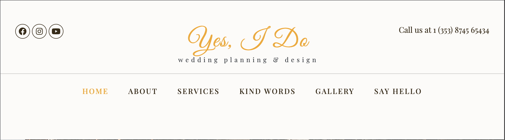 
   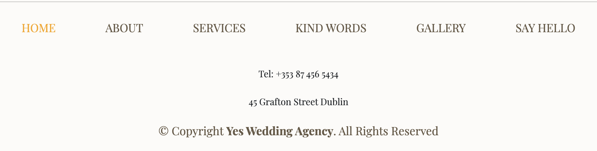
   
---

As a potential customer, I want to see this agency's gallery images from previous works.

   * As a Home page starts with an image carousel with the agency's works and throughout the page contains pictures about their work and pictures from the possible destination.
   * Clickable Gallery menu is on every page, in the top navigation bar, and in the footer. The customers easily can find and navigate to the Gallery page.
   * Bottom of the Gallery page has a call to action button that takes the user to the Say Hello ("contact") page.
   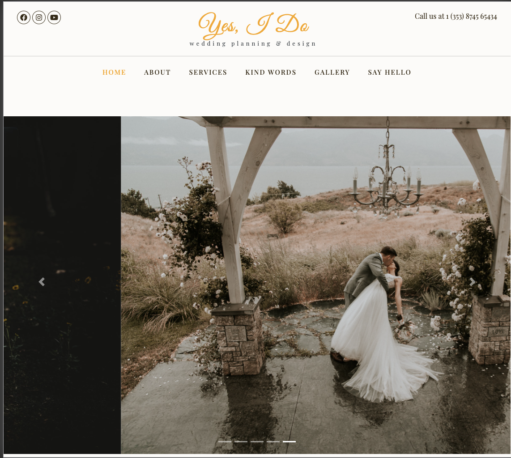
   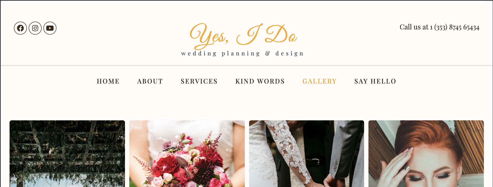
   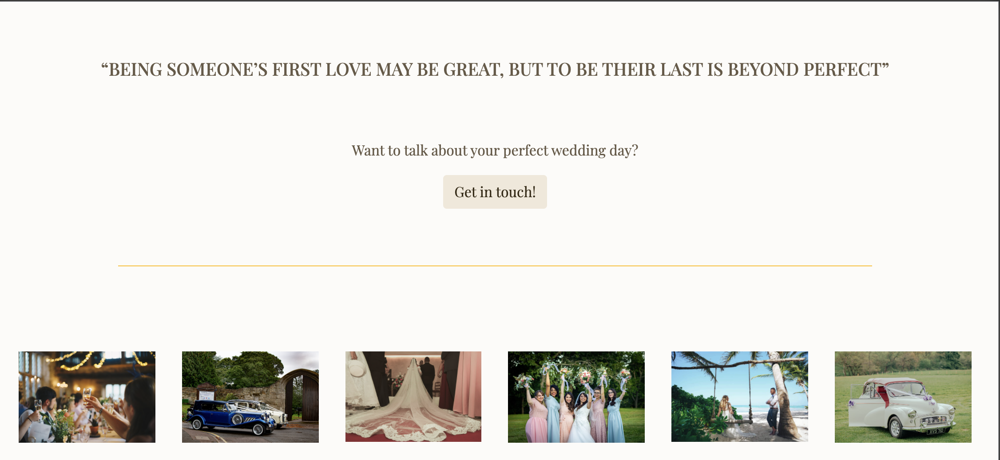
---

As a potential customer, I want to know more about the agency team members.

   * The customers easily can find the About page as in the top navigation bar and in the footer navigation bar.
   * About page contains a photo of the Agency Founder and her professional team. And on large devices an image carousel with their works.
   * Bottom of the About page has a call to action button that takes the user to the Say Hello ("contact") page.
   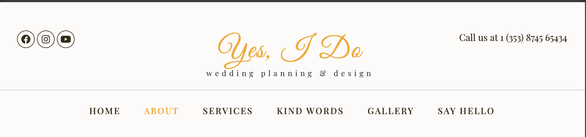
   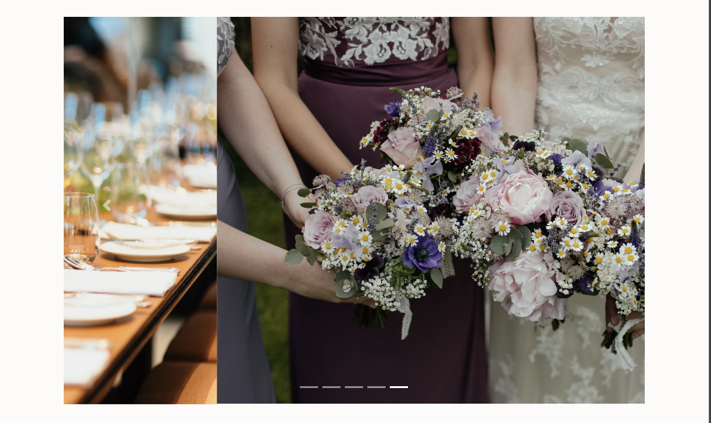
   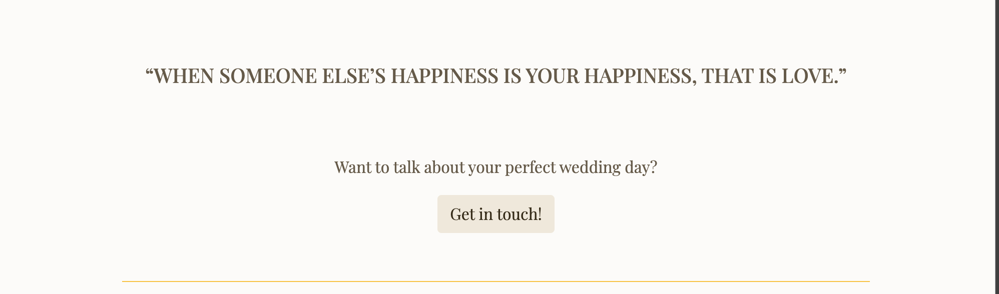
---

As a possible customer, I want to know what former clients thought of their works.

   * The customers easily can find the Kind Words menu in the top navigation bar and in the footer navigation bar as well.
   * The Kind Words page contains pictures from previous clients and their kind words ("testimonials").
   * Bottom of the Kind Words page has a call to action button that takes the user to the Say Hello ("contact") page.
   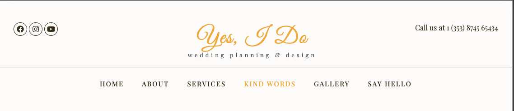
   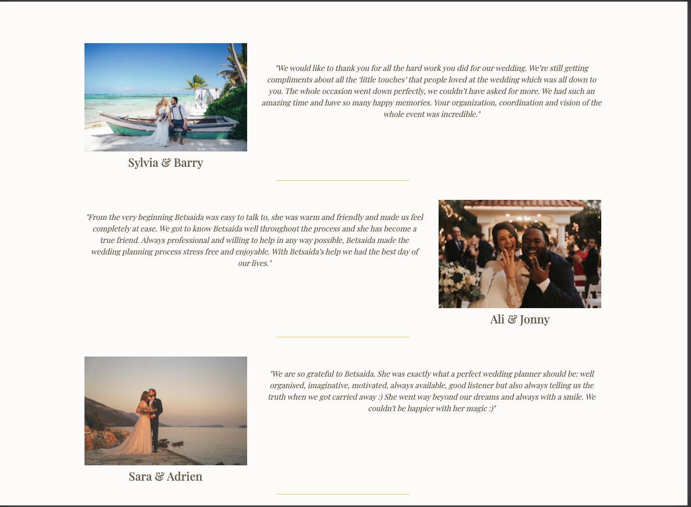
   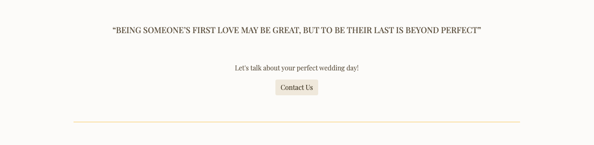
---

As an interested customer, I want to know what services they can offer.

   * On the Home page has a clear call to action button under the What We Do section which takes the user to the Services page.
   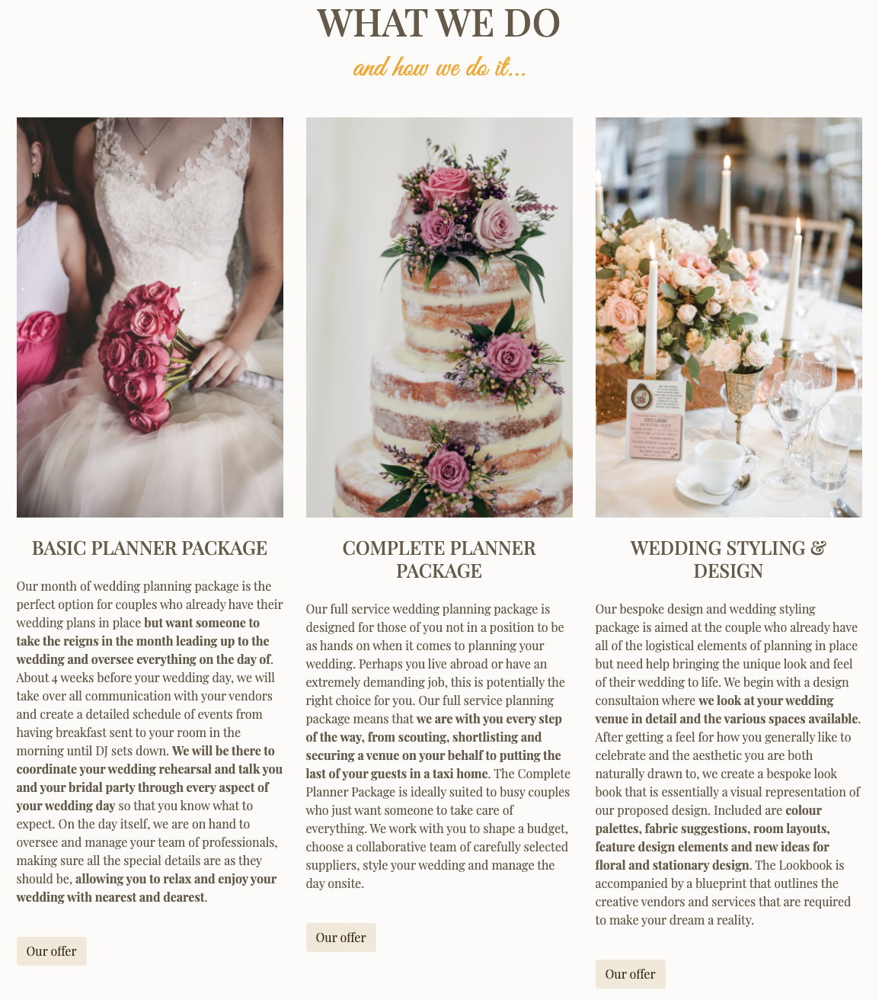
   * The customers easily can find the Services menu in the top navigation bar and in the footer navigation bar as well.
   * Bottom of the Services page has a call to action button that takes the user to the Say Hello ("contact") page.
   * The Services page contains pictures from the Agency's works and their services.
   * There are Call To Action buttons throughout the page that takes the user to the Say Hello ("contact") page.
   * The Services page contains image carousel with the Agency's works.
   * Images are throughout the page for the better visual look.  
   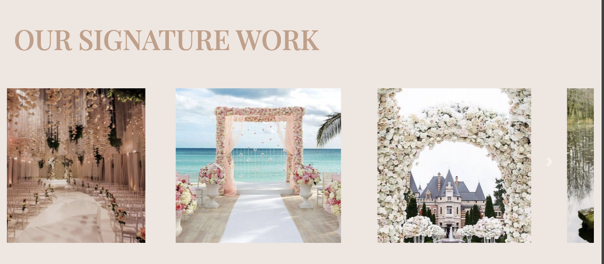
   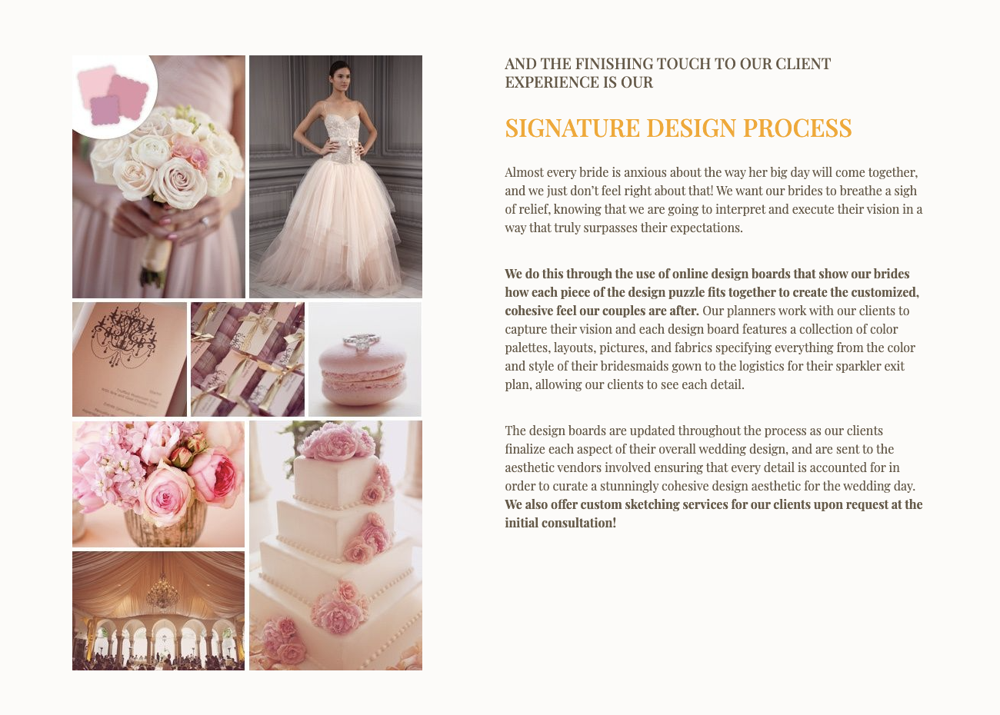
---

As an interested customer, I want simply navigate to the contact page and fill out the contact form.

   * The customers easily can find the Say Hello ("contact") page in the top navigation bar and in the footer navigation bar.
   * Every page contains call-to-action buttons that lead the interested customer to the Say Hello ("contact") page.
   * The customers easily can find the the contact form.
   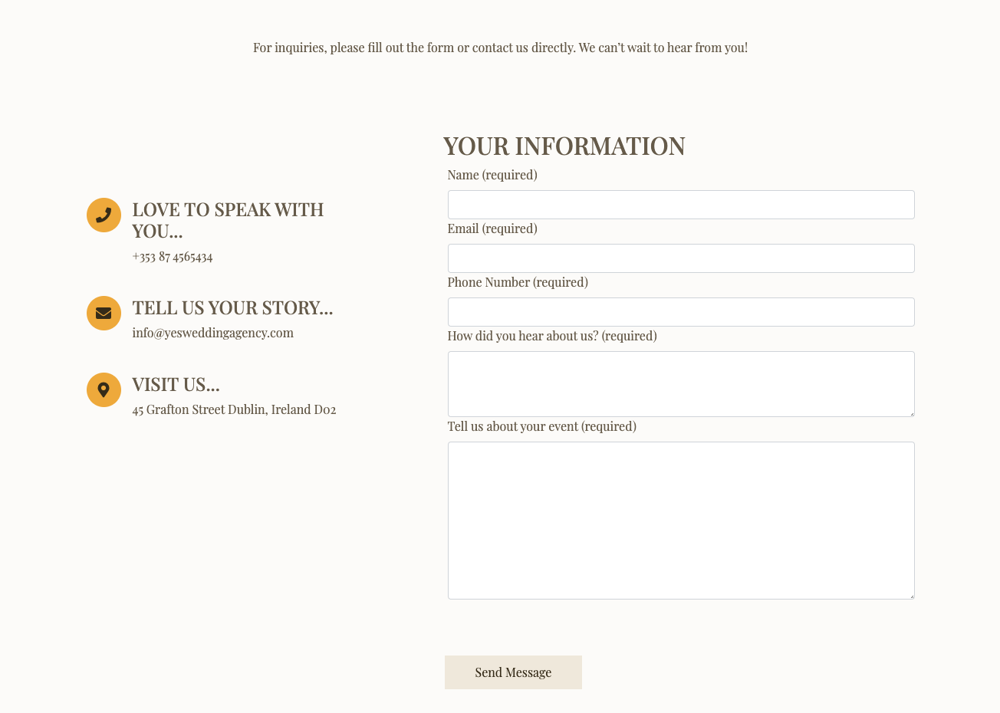
--- 

As an interested customer, I want to follow the agency on social media, so I can hear about their events and news.

   * The social media icons easily can find at the top of every page.
   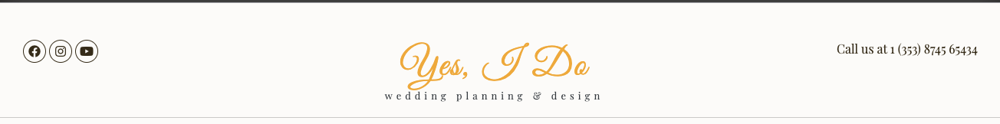

### Testing functionality of every page

**Home page:**

Top bar:

   * Tob bar responsiveness checking with change screen size from desktop to tablet and phone.
   Works as it expected. 
   * Hover over the Agency's logo, phone number, and the social icons the alt text appears and their color changed.
   * Clicking on the logo in the navigation bar that links to the Home page.
   * Click on each social media icon to confirm it opens a separate tab.  

Navigation bar:

   * Navigation responsiveness checking with change screen size from desktop to tablet and phone. Burger Icon dropdown menu at the correct place. Works as it expected.
   * Click on each navigation menu item and confirm that it links to the correct page.

Image Carousel:

   * Image carousel checking with change screen size from desktop to tablet and phone. Image carousel works as expected.

Content:

   * Text and image responsiveness checking with change screen size from desktop to tablet and phone.
   Works as expected and looks good on all device widths.

Fixed Image Background:

   * Fixed background Image responsiveness checking with change screen size from desktop to tablet and phone.
     - Testing the fixed bg image with Chrome and Firefox browser on MacBook, iMac, and Windows Desktop and Android devices work as expected. In further testing on Apple mobile devices such as iPhone and iPad some issues occurred. You can read about how was it fixed on the bottom of the page in the Further Testing section.
   * Media logos on small devices in the fixed image background is 1 column, on medium and large devices in 1 row.

Footer:

   * Footer responsiveness checking with change screen size from desktop to tablet and phone. Works as it expected.
   * Click on each navigation link to confirm is navigate to the chosen page.
   * Hover over the links their color has changed.

   Footer testing on Desktop:
      - Footer image section check - 6 responsive images only visible on large devices they disappear on medium and small devices. Works at expected.
      - Nav-tab footer check  which disappears on medium and small devices.

Call to action buttons:

   * Responsiveness checking with change screen size from desktop to tablet and phone.
   * Hover over each button and check color change.
   * Click on each button to check is leads to a correct page.

 
**About page:**

Top bar:

   * Repeat validation steps done for Top bar on the Home page. 

Navigation bar:

   * Repeat validation steps done for Navbar on the Home page.

Content:

   * Text and images responsiveness checking with change screen size from desktop to tablet and phone.

Image Carousel:

   * Image carousel checking with change screen size from desktop to tablet and phone. Image carousel works as expected, is **disappear on medium and small devices**.  

Footer:

   * Repeat validation steps done for Footer on the Home page. 

   Footer testing on Desktop:
      - Repeat validation steps done for Footer on the Home page. 

Call to action buttons:

   * Repeat validation steps done for call-to-action-buttons on the Home page

**Services page**

Top bar:

   * Repeat validation steps done for Top bar on the Home page. 

Navigation bar:

   * Repeat validation steps done for Navbar on the Home page.

Fixed Image Background:

   * Fixed background Image responsiveness checking with change screen size from desktop to tablet and phone.
     - Testing the fixed bg image with Chrome and Firefox browser on MacBook, iMac, and Windows Desktop and Android devices work as expected. In further testing on Apple mobile devices such as iPhone and iPad visibility issue occurred. You can read about how was it fixed on the bottom of the page in the Further Testing section.

Content:

   * Text and images responsiveness checking with change screen size from desktop to tablet and phone.

Image Carousel:

   * Image carousel checking with change screen size from desktop to tablet and phone. Image carousel works as expected, is **disappear on medium and small devices**.  

Footer:

   * Repeat validation steps done for Footer on the Home page. 

   Footer testing on Desktop:
      - Repeat validation steps done for Footer on the Home page. 

Call to action buttons:

   * Repeat validation steps done for call-to-action-buttons on the Home page

**Kind Words page**

Top bar:

   * Repeat validation steps done for Top bar on the Home page. 

Navigation bar:

   * Repeat validation steps done for Navbar on the Home page.

Content:

   * Kind Words responsiveness checking with change screen size from desktop to tablet and phone.
    - During testing order issue occurred.
      This was fixed by change the order of content.

Footer:

   * Repeat validation steps done for Footer on the Home page. 

   Footer testing on Desktop:
      * Repeat validation steps done for Footer on the Home page. 

Call to action buttons:

   * Repeat validation steps done for call-to-action-buttons on the Home page

**Gallery page**

Top bar:

   * Repeat validation steps done for Top bar on the Home page. 

Navigation bar:

   * Repeat validation steps done for Navbar on the Home page.

Content:

   * Gallery images responsiveness checking with change screen size from desktop to tablet and phone.
   * Workes as expected, 1 column layout in a small device, 2 column layout in a medium device, and 4 column layout in a large device.

Footer:

   * Repeat validation steps done for Footer on the Home page. 

   Footer testing on Desktop:
      * Repeat validation steps done for Footer on the Home page. 

Call to action buttons:

   * Repeat validation steps done for call-to-action-buttons on the Home page

**Say Hello page**

Top bar:

   * Repeat validation steps done for Top bar on the Home page. 

Navigation bar:

   * Repeat validation steps done for Navbar on the Home page.

Header image:

   * Image responsiveness checking with change screen size from desktop to tablet and phone.
    - During testing in an extra-large device the image stretched.
      This was fixed by using the object-fit CSS property on the img class in the contact stylesheet.

Text Content:

   * Text responsiveness checking with change screen size from desktop to tablet and phone.

Contact form:

   * Contact form responsiveness checking with change screen size from desktop to tablet and phone.
   * Submit the empty form and noticed that an error message about the required fields.
   * Submit the form with the Name empty and noticed that an error message about the required fields.
   * Submit the form with an invalid email address or empty email address field and noticed that an error message about the required fields.
   * Submit the form with the text field empty or one of them is empty and noticed that an error message about the required fields.
   * Submit the form with every field filled up correctly - noticed "This side can't be reached" error occurred.
     because the Agency's email address is imaginary.
     - To test this button copy and paste the [Code Institute](https://codeinstitute.net/5-day-coding-challenge/?utm_term=%2Bcode%20%2Binstitute&utm_campaign=a%26c_BR_IRL_Code_Institute&utm_source=adwords&utm_medium=ppc&hsa_net=adwords&hsa_tgt=kwd-319867642491&hsa_ad=326751276603&hsa_acc=8983321581&hsa_grp=56427889178&hsa_mt=b&hsa_cam=1378516521&hsa_kw=%2Bcode%20%2Binstitute&hsa_ver=3&hsa_src=g&gclid=EAIaIQobChMIiJjgxOrD7QIVz8LtCh3OQQgLEAAYASAAEgLd4vD_BwE&gclsrc=aw.ds) email address that we used in the **Love Running mini-project** to the contact form action method.
     The result was successful.
   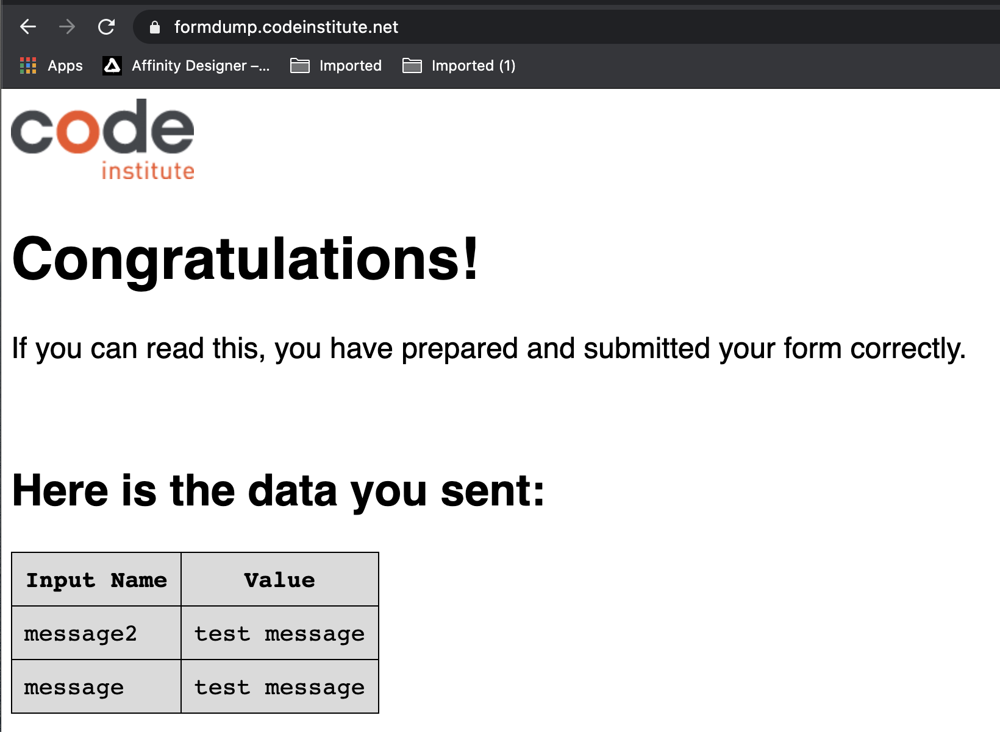
   
Footer:

   * Repeat validation steps done for Footer on the Home page. 

   Footer testing on Desktop:
      - Repeat validation steps done for Footer on the Home page. 

Call to action buttons:

   * Repeat validation steps done for call-to-action-buttons on the Home page

### Further testing:
I asked friends and family to look at the site on their devices and report any issues they find. 
* They reported - on Apple mobile devices - iPhone and iPad the pages that contain fixed image background couldn't load, only the fixed background image appeared. I found the same issue on the Safari browser as well.

As Home page-

As Services page
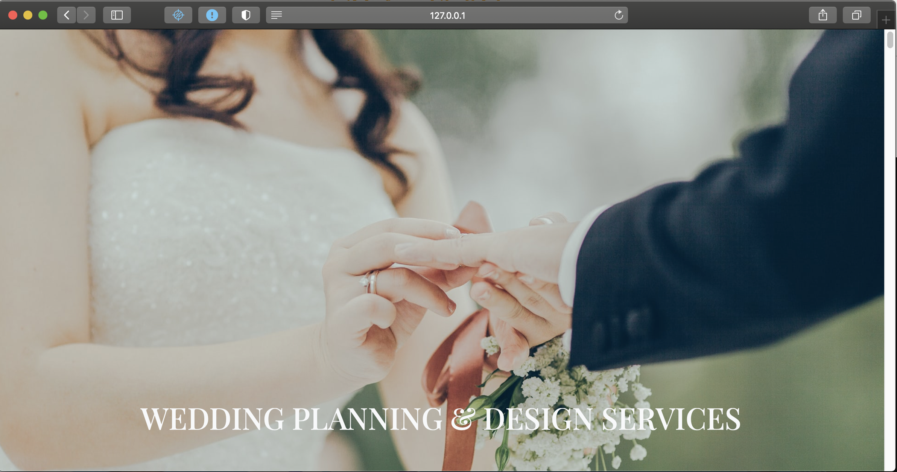

The fixed attribute position property was deleted on the home and services style sheet.

* On the Kind Words page first testimonial text was changed after they reported the text had a grammatical error.  
