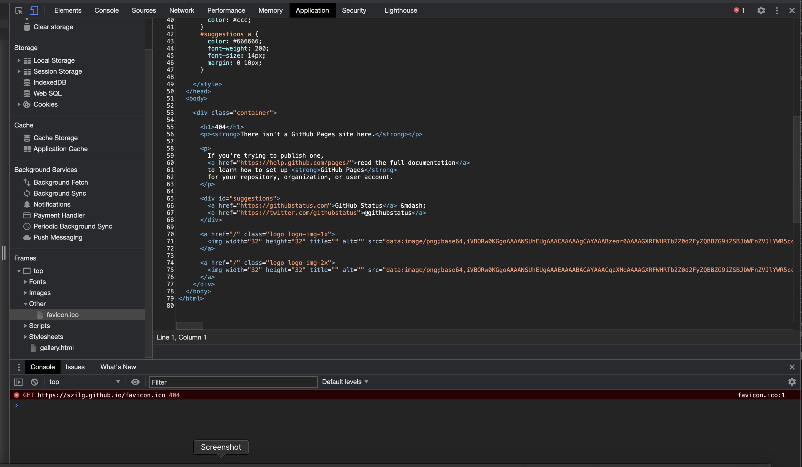

# Yes-I-Do-Wedding-Agency - Testing Details

[README.md file](https://github.com/szilG/Yes-I-Do-Wedding-Agency/blob/main/README.md)

## Testing 
* [W3C CSS Validation](https://jigsaw.w3.org/css-validator/)
* [W3C Markup Validation](https://validator.w3.org/)

The developer used W3C CSS Validation Service and W3C Markup Validation Service to test the code.

* [TinyPNG](https://tinypng.com/)

The developer used Tinypng to resize the images of the website.

### Client stories testing

As a potential customer, I want to easily navigate throughout the site and find what I need.

   * As every page has a navigation bar on the top and bottom of the page, the customer can easily find and navigate through the site.
   * As every page has a top bar on top of the page the customer can easily find the social icons and the agency's phone number and they can contact the agency immediately. 
   * As every page has a company logo image that when clicked takes the customer back to the Home page.
   * The home page has call-to-action buttons which take the user to the services page and the Say Hello ("contact") page.
    
   
   
   
---

As a potential customer, I want to see this agency's gallery images from previous works.

   * The Home page starts with an image carousel with the agency's works and throughout the page contains pictures about their work.
   * Clickable Gallery menu is on every page, in the top navigation bar, and in the footer. The customers can easily find and navigate to the Gallery page.
   * Bottom of the Gallery page has a call to action button that takes the user to the Say Hello ("contact") page.
   
   
   

---

As a potential customer, I want to know more about the agency's team members.

   * The customers can easily find the About page in the top navigation bar and in the footer navigation bar.
   * About page contains a photo of the Agency Founder and her professional team. And on large devices an image carousel with their works.
   * Bottom of the About page has a call to action button that takes the user to the Say Hello ("contact") page.
   
   
   

---

As a possible customer, I want to know what former clients thought of their works.

   * The customers can easily find the Kind Words page in the top navigation bar and in the footer navigation bar as well.
   * The Kind Words page contains pictures from previous clients and their kind words ("testimonials").
   * Bottom of the Kind Words page has a call to action button that takes the user to the Say Hello ("contact") page.
   
   
   

---

As an interested customer, I want to know what services they can offer.

   * On the Home page has a clear call to action button under the What We Do section which takes the user to the Services page.
      
   * The customers can easily find the Services menu in the top navigation bar and in the footer navigation bar as well.
   * Bottom of the Services page has a call to action button that takes the user to the Say Hello ("contact") page.
   * The Services page contains pictures from the Agency's works and their services.
   * There are Call To Action buttons throughout the page that takes the user to the Say Hello ("contact") page.
   * The Services page contains an image carousel with the Agency's works.
   * Images are throughout the page to generate interest.
   
   

---

As an interested customer, I want to simply navigate to the contact page and fill out the contact form.

   * The customers easily can find the Say Hello ("contact") page in the top navigation bar and in the footer navigation bar.
   * Every page contains call-to-action buttons that lead the interested customer to the Say Hello ("contact") page.
   * The customers can easily find the contact form.
   

--- 

As an interested customer, I want to follow the agency on social media, so I can hear about their events and news.

   * The social media icons can easily be found at the top of every page.
   

---

### Testing functionality of every page

**Home page:**

Top bar:

   * I checked the top bar's responsiveness by changing the screen size from desktop to tablet, to phone.
   Works as expected. 
   * I hovered over the Agency's logo, phone number, and the social icons, the alt text appeared and their color changed.
   * I clicked on the logo in the navigation bar that links to the Home page and was taken to the home page.
   * I clicked on each social media icon to confirm it opens in a separate tab.  

Navigation bar:

   * I checked the navigation's responsiveness by changing the screen size from desktop to tablet, to phone. Burger Icon dropdown menu in the correct place. Works as expected.
   * I clicked on each navigation menu item and confirmed that it links to the correct page.

Image Carousel:

   * I checked the image carousel by changing the screen size from desktop to tablet, to phone. Image carousel works as expected.

Content:

   * I checked the text and image by changing the screen size from desktop to tablet, to phone.
   Works as expected and looks good on all device widths.

Fixed Image Background:

   * I checked the fixed background image by changing the screen size from desktop to tablet, to phone.
     - I tested the fixed background image with Chrome and Firefox browser on MacBook, iMac, and Windows Desktop and Android devices, it works as expected. During further testing on Apple mobile devices such as iPhone and iPad some issues occurred. The fixing of the issue is documented on the bottom of the page in the Further Testing section.
   * Media logos on small devices in the fixed image background are in 1 column, on medium and large devices are in 1 row.

Footer:

   * I checked the footer by changing the screen size from desktop to tablet, to phone. Works as it expected.
   * I clicked on each navigation link to confirm it takes the user to the chosen page.
   * I hovered over the links, their color changed.

   Footer testing on Desktop:
      - Footer image section check - 6 responsive images only visible on large devices, they disappear on medium and small devices. Works at expected.
      - Nav-tab footer check disappears on medium and small devices. Works as expected.

Call to action buttons:

   * I checked the responsiveness by changing the screen size from desktop to tablet, to phone.
   * I hovered over each button and checked their color change.
   * I clicked on each button to check it leads to a correct page.

---

**About page:**

Top bar:

   * Repeat validation steps done for Top bar on the Home page. 

Navigation bar:

   * Repeat validation steps done for Navbar on the Home page.

Content:

   * I checked the text and images by changing the screen size from desktop to tablet, to phone.

Image Carousel:

   * I checked the image carousel by changing the screen size from desktop to tablet, to phone. Image carousel works as expected, it **disappear on medium and small devices**.  

Footer:

   * Repeat validation steps done for Footer on the Home page. 

   Footer testing on Desktop:
      - Repeat validation steps done for Footer on the Home page. 

Call to action buttons:

   * Repeat validation steps done for call-to-action-buttons on the Home page

---

**Services page**

Top bar:

   * Repeat validation steps done for Top bar on the Home page. 

Navigation bar:

   * Repeat validation steps done for Navbar on the Home page.

Fixed Image Background:

   * I checked the fixed background Image responsiveness by changing the screen size from desktop to tablet, to phone.
     - Tested the fixed background image with Chrome and Firefox browser on MacBook, iMac, and Windows Desktop and Android devices, it works as expected. During further testing on Apple mobile devices such as iPhone and iPad a visibility issue occurred. The fixing of the issue is documented on the bottom of the page in the Further Testing section.

Content:

   *  I checked the text and images by changing the screen size from desktop to tablet, to phone.

Image Carousel:

   * I checked the image carousel by changing the screen size from desktop to tablet, to phone. Image carousel works as expected, is **disappear on medium and small devices**.  

Footer:

   * Repeat validation steps done for Footer on the Home page. 

   Footer testing on Desktop:
      - Repeat validation steps done for Footer on the Home page. 

Call to action buttons:

   * Repeat validation steps done for call-to-action-buttons on the Home page

---

**Kind Words page**

Top bar:

   * Repeat validation steps done for Top bar on the Home page. 

Navigation bar:

   * Repeat validation steps done for Navbar on the Home page.

Content:

   * I checked the Kind Words page's responsiveness by changing the screen size from desktop to tablet, to phone.
    - During testing positioning issue occurred.
      This was fixed by changing the order of content.

Footer:

   * Repeat validation steps done for Footer on the Home page. 

   Footer testing on Desktop:
      * Repeat validation steps done for Footer on the Home page. 

Call to action buttons:

   * Repeat validation steps done for call-to-action-buttons on the Home page

---

**Gallery page**

Top bar:

   * Repeat validation steps done for Top bar on the Home page. 

Navigation bar:

   * Repeat validation steps done for Navbar on the Home page.

Content:

   * I checked the gallery images responsiveness by changing the screen size from desktop to tablet, to phone.
   * Workes as expected, 1 column layout in a small device, 2 column layout in a medium device, and 4 column layout in a large device.

Footer:

   * Repeat validation steps done for Footer on the Home page. 

   Footer testing on Desktop:
      * Repeat validation steps done for Footer on the Home page. 

Call to action buttons:

   * Repeat validation steps done for call-to-action-buttons on the Home page

---

**Say Hello page**

Top bar:

   * Repeat validation steps done for Top bar on the Home page. 

Navigation bar:

   * Repeat validation steps done for Navbar on the Home page.

Header image:

   * I checked the image's responsiveness by changing the screen size from desktop to tablet, to phone.
    - During testing on an extra-large sreen size the image stretched.
      This was fixed by using the object-fit CSS property on the img class in the contact stylesheet.

Text Content:

   * I checked the text's responsiveness by changing the screen size from desktop to tablet, to phone.

Contact form:

   * I checked the contact form's responsiveness by changing the screen size from desktop to tablet, to phone.
   * I submitted the empty form and an error message popped up about filling in the required fields.
   * I submitted the form with the Name field left empty and received an error message to fill out the required field.
   * I submitted the form with both an invalid email address and later an empty email address field and noticed that an error message to fill out the required field popped up.
   * I submitted the form with first both the text fields left empty and later with only one of them left empty and noticed both times that a message popped up to fill out the required field/s.
   * I submitted the form with every field filled in correctly and received a "This site can't be reached" error message
     (because the Agency's email address is imaginary).
     - I tested the submit button by copy and pasting the [Code Institute](https://codeinstitute.net/5-day-coding-challenge/?utm_term=%2Bcode%20%2Binstitute&utm_campaign=a%26c_BR_IRL_Code_Institute&utm_source=adwords&utm_medium=ppc&hsa_net=adwords&hsa_tgt=kwd-319867642491&hsa_ad=326751276603&hsa_acc=8983321581&hsa_grp=56427889178&hsa_mt=b&hsa_cam=1378516521&hsa_kw=%2Bcode%20%2Binstitute&hsa_ver=3&hsa_src=g&gclid=EAIaIQobChMIiJjgxOrD7QIVz8LtCh3OQQgLEAAYASAAEgLd4vD_BwE&gclsrc=aw.ds) email address that we used in the **Love Running mini-project** to the contact form action method.
     The result was successful.
   
   
Footer:

   * Repeat validation steps done for Footer on the Home page. 

   Footer testing on Desktop:
      - Repeat validation steps done for Footer on the Home page. 

Call to action buttons:

   * Repeat validation steps done for call-to-action-buttons on the Home page

---

### Further testing:
I asked friends and family to look at the site on their devices and report any issues they find. 
1. They reported - on Apple mobile devices - iPhone and iPad the pages that contain fixed image background couldn't load, only the fixed background image appeared. I found the same issue on the Safari browser as well.

As Home page

As Services page

I deleted the fixed attribute position property on the home and services style sheet.

   
   

2. On the Kind Words page I changed the first testimonial text after they reported the text had a grammatical error. 

3. In final testing some favicon issue occured.

   

 - To solve this problem I generated a favicon from jpg image [here](https://image.online-convert.com/convert-to-ico)
  after I copied that into the root directory.
 - I put the link tag into the head element. I found explanation from it [here](https://stackoverflow.com/questions/9943771/adding-a-favicon-to-a-static-html-page)

  `<link rel="icon" type="image/x-icon" href="favicon.ico">` 

   

   The image used for favicon can be find [here](https://www.pinterest.com/pin/791929915708765787/)